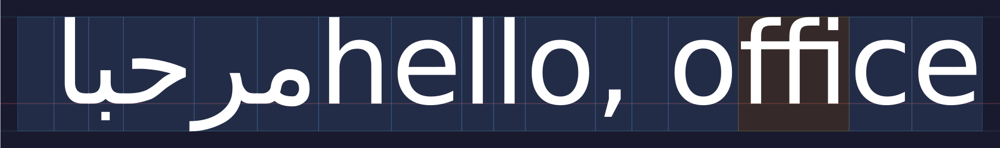
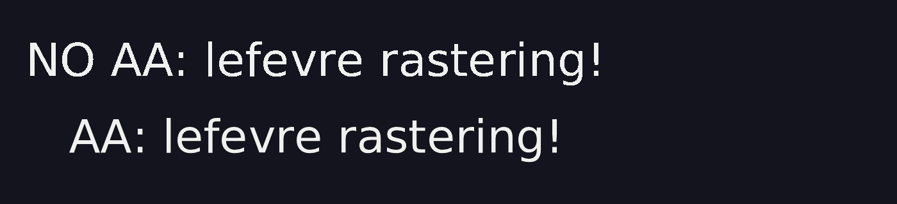

# lefevre
[](https://pkg.go.dev/github.com/soypat/lefevre)
[](https://goreportcard.com/report/github.com/soypat/lefevre)
[](https://codecov.io/gh/soypat/lefevre)
[](https://github.com/soypat/lefevre/actions/workflows/go.yml)
[](https://sourcegraph.com/github.com/soypat/lefevre?badge)

This is a Go rewrite of [kb_text_shape.h](https://github.com/JimmyLefevre/kb) (v2.14, by Jimmy Lefevre), a 28K-line single-header C library for Unicode text segmentation and OpenType shaping.

It also now includes text rasterizing in [raster](./raster/) package.


## Scope/Roadmap
The scope of this package is fulfilled. A pure go, no dependency package to do text shaping and rastering.

What remains is reducing heap allocations and improving APIs to be more comfy and performant.

## Examples
Below is the result of running

```
echo "مرحبا hello, office résumé?" | go run ./examples/visual/ testdata/DejaVuSans.ttf > lefevre.svg
```



A CPU rasterization demo is also available:

```
go run ./examples/raster/ -font testdata/DejaVuSans.ttf 
```


## LLM policy
This project is in great part assisted by LLMs.